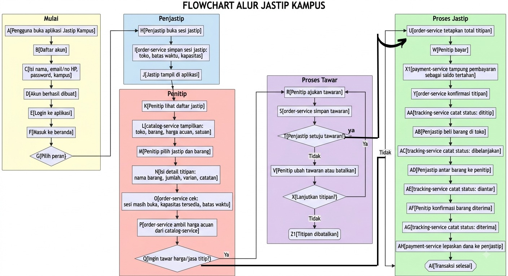

# 🛍️ Jastip Kampus

> Runtime terbaru memakai PostgreSQL/Redis, tiga replika Order Service, akun reguler dua mode, negosiasi biaya jasa, escrow simulasi, dan Expo Router. Petunjuk konfigurasi serta batas hasil uji aktual ada di [docs/POSTGRESQL-OVERHAUL.md](docs/POSTGRESQL-OVERHAUL.md). Dokumentasi lama yang masih menyebut SQLite dipertahankan sebagai arsip historis dan bukan acuan runtime.

<div align="center">

**Sistem Titip-Beli Antarr Mahasiswa berbasis Microservices**


</div>

---

Jastip Kampus adalah platform layanan **titip-beli antar mahasiswa**. Mahasiswa dapat membuka layanan jastip, memilih barang, melakukan pembayaran, dan melacak status titipan hingga barang diterima.

## Reset dan seed demo workbook

Perintah berikut bersifat destruktif dan hanya untuk Codespaces/lingkungan demo. Perintah menghapus volume PostgreSQL, Redis, serta upload milik Compose project ini, lalu memasukkan tepat 9 akun, 20 toko, 34 produk/foto, 5 sesi, 7 titipan, 6 pembayaran, dan 15 event tracking.

```bash
npm run demo:reset-and-seed -- --confirm-reset
```

### Menjalankan Expo Go dari Codespaces

Gunakan launcher khusus agar aplikasi di ponsel mengakses gateway Codespaces,
bukan `localhost` milik ponsel:

```bash
cd mobile
npm run start:codespaces
```

Scan QR baru yang ditampilkan. Port `8080` harus memiliki visibility **Public** agar
Expo Go dapat mengakses API. Web dan Expo Go menggunakan penyimpanan sesi yang
berbeda, sehingga login perlu dilakukan sekali pada masing-masing perangkat.

### Checklist jalankan sistem (Web + Expo Go)

Gunakan urutan ini agar semua anggota tim menjalankan stack yang sama dan hasilnya konsisten:

1. Infrastructure & DevOps menyalakan seluruh service:

```bash
docker compose up -d --build
docker compose ps
```

2. Data & Persistence Engineer reset dan seed data demo:

```bash
npm run demo:reset-and-seed -- --confirm-reset
```

3. Infrastructure & DevOps memastikan gateway dapat diakses dari luar Codespaces:

```bash
gh codespace ports visibility 8080:public -c "$CODESPACE_NAME"
curl https://$CODESPACE_NAME-8080.app.github.dev/health
```

4. Backend/API Engineer memverifikasi login API:

```bash
curl -X POST https://$CODESPACE_NAME-8080.app.github.dev/v1/login \
  -H 'content-type: application/json' \
  -d '{"email":"andi.rizki@unismuh.ac.id","password":"Penjastip2026!"}'
```

5. QA dan Dokumentasi menjalankan klien mobile/web Expo:

```bash
cd mobile
npm run start:codespaces
```

6. Uji login web: buka URL web Expo dari terminal Metro, lalu login.
7. Uji login HP (Expo Go): scan QR yang sama, lalu login akun yang sama atau akun demo lain.
8. Jika web berhasil tetapi HP gagal konek API, lakukan urutan berikut: tutup paksa Expo Go, buka lagi, scan ulang QR terbaru, pastikan port `8080` tetap `Public`, lalu jalankan ulang `npm run start:codespaces` dari folder `mobile`.

Rujukan sinkronisasi peran detail ada di [PERAN.md](PERAN.md).

Password semua akun demo adalah `Penjastip2026!` (jangan digunakan di produksi). Empat akun berlabel Penjastip:

| Nama | Email |
| --- | --- |
| Rizki Amalia Rasyid | `rizki.amalia@unismuh.ac.id` |
| Muh. Iqbal Tawakkal | `iqbal.tawakkal@unhas.ac.id` |
| Putri Handayani | `putri.handa@uin-alauddin.ac.id` |
| Dika Pratama | `dika.pratama@polmed.ac.id` |

Lima akun berlabel Penitip: `andi.rizki@unismuh.ac.id`, `siti.rahma@unhas.ac.id`, `m.fauzi@uin-alauddin.ac.id`, `nurul.hidayah@stie-tri.ac.id`, dan `bagas.suli@polmed.ac.id`. Semua akun reguler tetap dapat memilih kedua mode. Admin dibuat terpisah dengan `npm run bootstrap:admin`.

Sistem dirancang menggunakan pendekatan **Microservices Architecture** — setiap layanan berdiri sendiri dengan data dan tanggung jawabnya masing-masing.

---

## 📋 Daftar Isi

| No | Topik |
| :---: | --- |
| 1 | [Tujuan Sistem](#1-tujuan-sistem) |
| 2 | [Arsitektur Microservices](#2-arsitektur-microservices) |
| 3 | [Alur Sistem](#3-alur-sistem) |
| 4 | [Peran dalam Sistem](#4-peran-dalam-sistem) |
| 5 | [Proses Tawar](#5-proses-tawar) |
| 6 | [Proses Pembayaran](#6-proses-pembayaran) |
| 7 | [Tracking Titipan](#7-tracking-titipan) |
| 8 | [Endpoint Kritis](#8-endpoint-kritis) |
| 9 | [Struktur Repository](#9-struktur-repository) |
| 10 | [Menjalankan Catalog Service](#10-menjalankan-catalog-service) |
| 11 | [Pengujian API](#11-pengujian-api) |
| 12 | [OpenAPI](#12-openapi) |
| 13 | [Aturan Penting Sistem](#13-aturan-penting-sistem) |
| 14 | [Teknologi](#14-teknologi) |
| 15 | [Status Pengembangan](#15-status-pengembangan) |

---

## 1. Tujuan Sistem

Sistem Jastip Kampus dirancang untuk:

- 🏪 Memudahkan mahasiswa **membuka layanan jastip** dengan menentukan toko, batas waktu, dan kapasitas.
- 🔍 Memudahkan mahasiswa lain **mencari dan memilih** layanan jastip yang tersedia.
- 📦 Menampilkan informasi **toko, barang, harga acuan**, dan satuan.
- 💬 Memungkinkan penitip **mengajukan tawaran** harga atau jasa titip.
- 💳 Mengelola **pembayaran** penitip secara aman dengan sistem dana tertahan.
- 📡 **Melacak status titipan** dari awal hingga barang diterima.
- 🔒 Menjaga **kapasitas jastip** agar tidak melebihi batas yang ditentukan penjastip.

---

## 2. Arsitektur Microservices

Sistem terdiri dari **empat layanan utama** yang berdiri sendiri:

| Layanan | Tanggung Jawab | Data yang Dimiliki |
| --- | --- | --- |
| `order-service` | Sesi jastip, buka/tutup titipan, kapasitas | Sesi jastip, daftar titipan, batas waktu, kapasitas |
| `catalog-service` | Toko, barang, harga acuan, satuan | Toko, barang, harga acuan, satuan |
| `payment-service` | Pembayaran dan pelepasan dana | Transaksi, saldo tertahan, riwayat pelepasan |
| `tracking-service` | Status perjalanan titipan | Riwayat status titipan dan waktu |

> 📌 **Prinsip:** Setiap service memiliki database sendiri. Service lain **tidak boleh** mengakses database service secara langsung — komunikasi dilakukan melalui **API atau event**.

### ⚠️ Sumber Daya Rebutan: Kapasitas Penjastip

Sumber daya kritis yang harus dijaga adalah **kapasitas titipan milik penjastip**.

```
Kapasitas = 10  →  Titipan berhasil : maksimal 10
                   Titipan ke-11    : ❌ DITOLAK
```

> 🔒 **Sistem menjamin kapasitas tidak terlampaui meskipun ribuan mahasiswa melakukan titip-beli secara bersamaan.**
> Aturan ini ditangani oleh **`order-service`**.

---

## 3. Alur Sistem

Flowchart berikut menggambarkan alur lengkap sistem — mulai dari registrasi, pemilihan peran, proses titipan, pembayaran, hingga transaksi selesai.



### Alur Operasional (2 Role)

Alur runtime utama hanya memakai dua role pengguna reguler: `Penitip` dan `Penjastip`.

1. Pengguna membuka aplikasi.
2. Pengguna daftar akun dengan data: nama, email, no HP, password, kampus.
3. Pengguna login.
4. Pengguna memilih mode peran: `Penitip` atau `Penjastip`.
5. Penjastip membuka sesi jastip (toko, batas waktu, kapasitas).
6. Penitip melihat sesi aktif, memilih barang, lalu mengisi detail titipan (jumlah, varian, catatan).
7. `order-service` memvalidasi sesi (masih buka, kapasitas tersedia, belum melewati deadline) dan mengambil harga acuan.
8. Penitip memilih jalur:
  - tanpa tawar: lanjut proses pembayaran.
  - dengan tawar: kirim tawaran, lalu penjastip menerima/menolak. Jika ditolak, penitip revisi tawaran atau batalkan.
9. Jika lanjut, `order-service` menetapkan total titipan final.
10. Penitip melakukan pembayaran; `payment-service` menahan dana sebagai escrow.
11. Tracking berjalan berurutan: `dititip -> dibelanjakan -> diantar -> diterima`.
12. Setelah penitip konfirmasi diterima, `payment-service` melepas dana ke penjastip.
13. Transaksi selesai.

---

## 4. Peran dalam Sistem

### 👤 Penjastip

> Mahasiswa yang **membuka dan mengelola** layanan titip-beli.

| # | Aksi | Keterangan |
| :---: | --- | --- |
| 1 | Buka sesi jastip | Menentukan toko, batas waktu, dan kapasitas titipan |
| 2 | Kelola tawaran | Menyetujui atau menolak tawaran harga dari penitip |
| 3 | Beli barang | Membeli barang sesuai titipan yang masuk |
| 4 | Antar barang | Mengantarkan barang kepada penitip |

---

### 👤 Penitip

> Mahasiswa yang **menggunakan** layanan titip-beli.

| # | Aksi | Keterangan |
| :---: | --- | --- |
| 1 | Cari jastip | Melihat daftar jastip yang sedang aktif |
| 2 | Pilih barang | Memilih barang, jumlah, varian, dan catatan |
| 3 | Tawar harga | Mengajukan tawaran harga atau jasa titip (opsional) |
| 4 | Bayar | Melakukan pembayaran titipan |
| 5 | Konfirmasi terima | Mengonfirmasi barang sudah diterima |

---

## 5. Proses Tawar

Penitip dapat mengajukan tawaran sebelum melakukan pembayaran.

```
Penitip mengajukan tawaran
          │
          ▼
  Order-service menyimpan tawaran
          │
          ▼
  Penjastip meninjau tawaran
        /       \
      Ya         Tidak
      │             │
      ▼             ▼
  Lanjut ke     Penitip ubah tawaran
  pembayaran    atau batalkan titipan
```

---

## 6. Proses Pembayaran

Pembayaran dikelola oleh `payment-service` menggunakan sistem **dana tertahan (escrow)** — dana baru dilepaskan setelah transaksi selesai.

```
[1] Penitip bayar
         │
         ▼
[2] payment-service → Dana ditahan (escrow)
         │
         ▼
[3] order-service konfirmasi titipan
         │
         · · · proses titipan berlangsung · · ·
         │
         ▼
[4] Penitip konfirmasi barang diterima
         │
         ▼
[5] payment-service → Dana dilepaskan ke penjastip ✅
```

> ⚠️ Dana **tidak langsung** diterima penjastip. Dana ditahan hingga penitip mengonfirmasi penerimaan barang.

---

## 7. Tracking Titipan

Status titipan dicatat secara berurutan oleh `tracking-service`.

```
[ DITITIP ] ──► [ DIBELANJAKAN ] ──► [ DIANTAR ] ──► [ DITERIMA ]
```

| Status | Pemicu | Keterangan |
| --- | --- | --- |
| `DITITIP` | Konfirmasi titipan | Titipan telah dikonfirmasi dan pembayaran ditahan |
| `DIBELANJAKAN` | Penjastip beli barang | Penjastip telah membeli barang titipan |
| `DIANTAR` | Penjastip antar barang | Barang sedang dalam perjalanan ke penitip |
| `DITERIMA` | Penitip konfirmasi | Penitip mengonfirmasi barang telah diterima |

---

## 8. Endpoint Kritis

### Daftar Endpoint Utama

| Method | Endpoint | Service | Fungsi |
| :---: | --- | --- | --- |
| `GET` | `/v1/items` | `catalog-service` | Mengambil daftar toko, barang, dan harga acuan |
| `POST` | `/v1/titipan` | `order-service` | Membuat titipan baru |
| `POST` | `/v1/payments` | `payment-service` | Membuat transaksi pembayaran |

### ⚡ Endpoint Paling Kritis

```
POST /v1/titipan
```

Endpoint ini berkaitan langsung dengan **kapasitas penjastip**. Sistem wajib memastikan:

| Kondisi | Status |
| --- | :---: |
| `jumlah titipan ≤ kapasitas` | ✅ Diterima |
| `jumlah titipan > kapasitas` | ❌ Ditolak |

---

## 9. Struktur Repository

```
jastip-kampus/
│
├── 📄 .gitignore
├── 📄 README.md
├── 📄 openapi.yaml
├── 📄 docker-compose.yml
│
├── 📁 docs/
│   ├── ARSITEKTUR.md
│   ├── ENDPOINTS.md
│   ├── TESTING.md
│   └── LAPORAN-UJI.md
│
└── 📁 services/
  ├── catalog-service/
  ├── order-service/
  ├── payment-service/
  └── tracking-service/
```

> `node_modules/` tidak disimpan di Git — sudah terdaftar di `.gitignore`.

---

## 10. Menjalankan Sistem (Compose + Gateway)

### Prasyarat

- Docker + Docker Compose
- Node.js + npm (untuk script bantu)

### Langkah Menjalankan

**Step 1 — Jalankan semua service:**

```bash
docker compose up -d --build
docker compose ps
```

**Step 2 — Seed data demo workbook:**

```bash
npm run demo:reset-and-seed -- --confirm-reset
```

**Step 3 — Verifikasi gateway sehat:**

```bash
curl http://localhost:8080/health
```

**Step 4 — Verifikasi alur E2E otomatis:**

```bash
node scripts/smoke-test.mjs
```

---

## 11. Pengujian API

### 🟢 Health Check

```bash
curl http://localhost:8080/health
```

```json
{
  "status": "ok"
}
```

---

### 📦 Mengambil Semua Item

```bash
curl http://localhost:8080/v1/items
```

---

### 🔍 Mengambil Item Berdasarkan ID

```bash
curl http://localhost:8080/v1/sessions?page=1&limit=20
```

---

## 12. OpenAPI

Kontrak API sistem tersimpan di:

```
openapi.yaml
```

Gunakan **Swagger Editor** untuk membaca dokumentasi API secara interaktif:

🔗 [**https://editor.swagger.io/**](https://editor.swagger.io/)

> Import file `openapi.yaml` ke Swagger Editor untuk melihat semua endpoint, parameter, dan response schema.

---

## 13. Aturan Penting Sistem

Sistem wajib menegakkan aturan berikut setiap saat:

| # | Aturan | Kondisi yang Harus Terpenuhi |
| :---: | --- | --- |
| 1 | Kapasitas tidak boleh terlampaui | `jumlah titipan ≤ kapasitas` |
| 2 | Titipan hanya saat sesi aktif | `status sesi = buka` |
| 3 | Kapasitas harus tersedia | `kapasitas tersisa > 0` |
| 4 | Dana ditahan hingga transaksi selesai | Dana dilepas setelah penitip konfirmasi terima |
| 5 | Status tracking harus berurutan | `DITITIP → DIBELANJAKAN → DIANTAR → DITERIMA` |

---

## 14. Teknologi

| Kategori | Teknologi | Keterangan |
| --- | --- | --- |
| Runtime | **Node.js** | Lingkungan eksekusi JavaScript |
| Framework | **Express.js** | Framework REST API |
| Database | **PostgreSQL** | Penyimpanan per-service |
| Cache/Event | **Redis** | Cache dan event transport |
| Gateway | **Nginx** | Routing dan rate limiting |
| API Contract | **OpenAPI 3.0.3** | Kontrak dan dokumentasi API |
| Version Control | **Git + GitHub** | Manajemen kode sumber |
| Editor | **Visual Studio Code** | IDE pengembangan |

---

## 15. Status Pengembangan

### ✅ Status Runtime Saat Ini

| Komponen | Status |
| --- | :---: |
| PostgreSQL + Redis aktif | ✅ |
| 4 service (`catalog`, `order`, `payment`, `tracking`) | ✅ |
| Gateway Nginx + endpoint `/v1/*` | ✅ |
| Kontrak `openapi.yaml` valid | ✅ |
| Smoke test E2E | ✅ |
| Dokumen QA (testing, laporan uji, template bukti) | ✅ |

---

### 🔲 Roadmap Lanjutan (Opsional)

| Komponen | Status |
| --- | :---: |
| CI/CD pipeline otomatis penuh | 🔲 |
| Observability (metrics + tracing) | 🔲 |
| Hardening security untuk production | 🔲 |
| Tuning performa lanjutan berbasis load test | 🔲 |

---

## 👨‍💻 Tentang Proyek

Project ini dikembangkan sebagai proyek pembelajaran arsitektur **Microservices** dengan studi kasus nyata **Jastip Kampus**.

**Fokus utama:** menjaga **konsistensi kapasitas titipan penjastip** ketika terjadi banyak permintaan secara bersamaan — menguji ketahanan sistem terhadap kondisi *high concurrency*.

## Admin dashboard

Akun admin tidak dapat dibuat dari registrasi publik. Jalankan order-service sekali agar migrasi diterapkan, lalu dari root project gunakan PowerShell:

```powershell
$env:ADMIN_NAME="Administrator"
$env:ADMIN_EMAIL="admin@jastip.local"
$env:ADMIN_PASSWORD="ganti-dengan-password-kuat"
npm run bootstrap:admin
```

Untuk runtime Docker/Compose, jalankan perintah bootstrap pada service order dengan environment admin yang sama. Setelah login dari Expo/web, role admin otomatis membuka dashboard responsif.
